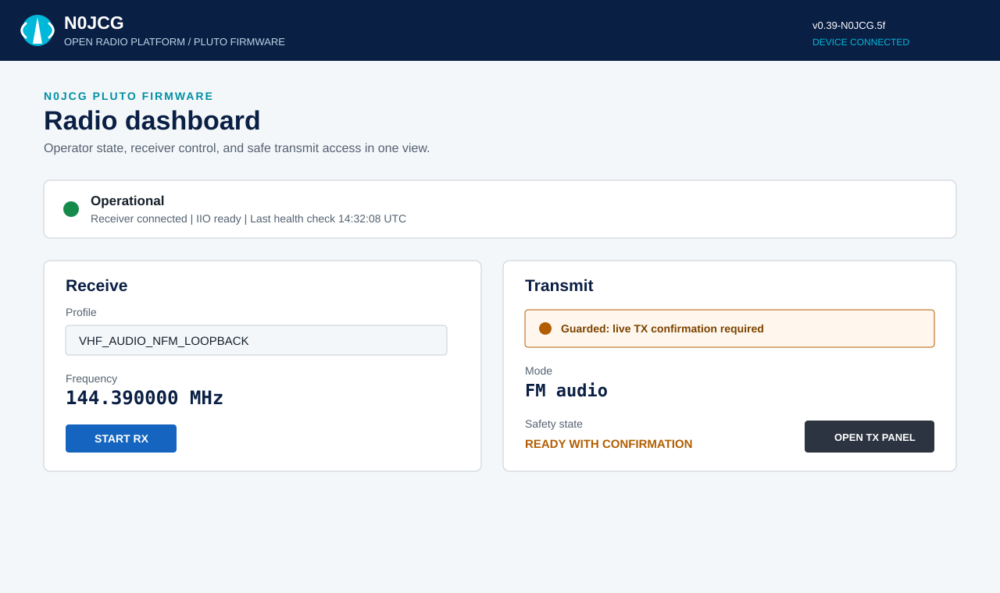
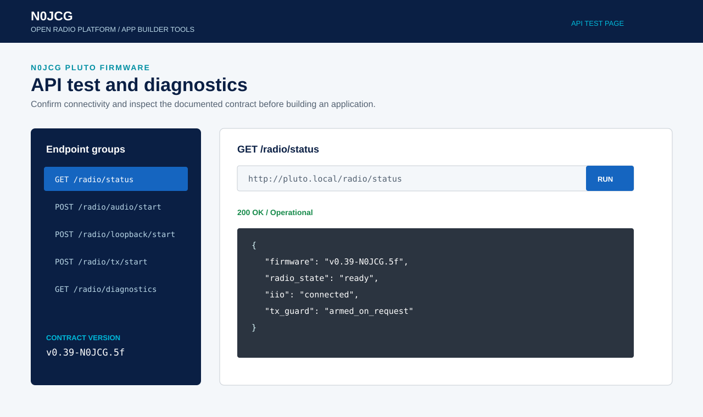

# N0JCG Pluto Firmware

## User Guide

**Open Radio Platform**
**Release:** `v0.39-N0JCG.5f`
**Audience:** station operators, app builders, and maintainers
**Status:** release guide

| Guide metadata | Value |
|---|---|
| Product | N0JCG Pluto Firmware |
| Release | `v0.39-N0JCG.5f` |
| Type | Operator and app-builder user guide |
| Estimated setup | 20 minutes for a prepared SD card; 45 minutes for first commissioning |
| Normal daily workflow | 5 minutes |
| Source contract | [`firmware-api-contract.md`](firmware-api-contract.md) |
| Owner | N0JCG Open Radio Platform |

## Contents

1. [What this firmware provides](#1-what-this-firmware-provides)
2. [Hardware and network setup](#2-hardware-and-network-setup)
3. [Operator workflow](#3-operator-workflow)
4. [App-builder API](#4-app-builder-api)
5. [Loopback and self-test](#5-loopback-and-self-test)
6. [Calibration and guard rails](#6-calibration-and-guard-rails)
7. [Troubleshooting](#7-troubleshooting)
8. [Install and boot the release](#8-install-and-boot-the-release)
9. [Understand the dashboard](#9-understand-the-dashboard)
10. [Receive audio and IQ data](#10-receive-audio-and-iq-data)
11. [Capture and spectrum workflows](#11-capture-and-spectrum-workflows)
12. [Transmit AM, FM, CW, and FT8 test signals](#12-transmit-am-fm-cw-and-ft8-test-signals)
13. [Calibration workflow](#13-calibration-workflow)
14. [Self-test and acceptance checks](#14-self-test-and-acceptance-checks)
15. [Doppler-assisted operation](#15-doppler-assisted-operation)
16. [Build an application client](#16-build-an-application-client)
17. [Maintenance and recovery](#17-maintenance-and-recovery)
18. [Release identification](#18-release-identification)



*Figure 1. Operator dashboard screen reference. The live state label, receiver controls, and guarded transmit panel are intentionally visible together.*

> **Brand and safety note**
> N0JCG uses the numeral zero in `N0JCG`. Receive and transmit are separate operating states. Never connect a Pluto transmitter directly to a receiver input; use the required attenuation or an appropriate RF load.

## 1. What this firmware provides

N0JCG Pluto Firmware is the reusable radio appliance layer for PlutoSDR and Pluto Plus applications. It keeps RF/IIO control, DSP, audio streaming, diagnostics, and transmit safety in firmware so multiple applications can share the same contract.

Core capabilities include:

- Receive audio and IQ workflows through documented HTTP endpoints.
- Native DSP services for FM, AM, CW, loopback, and signal diagnostics.
- Guarded live transmission for AM audio, FM audio, and CW.
- File-backed FM audio TX, including APRS-compatible 1200-baud audio.
- Loopback and self-test paths for development without an antenna.
- App-builder status, diagnostics, and API contract endpoints.

## 2. Hardware and network setup

### Minimum equipment

- PlutoSDR or compatible Pluto Plus board.
- USB OTG connection for initial setup and recovery.
- Ethernet connection when using a fixed station address.
- Suitable antenna, dummy load, or attenuated test connection.
- For RF loopback: TX1 to RX1 through at least a 30 dB attenuator.

### First connection

1. Power the Pluto off.
2. Connect the OTG USB port to the host computer.
3. Insert the release SD card or install the SD boot files from the release package.
4. Set the board for SD boot and power it on.
5. Open `http://192.168.2.1/dashboard.html` for a USB-networked board, or use the board's assigned Ethernet address.
6. Open `http://192.168.2.1/api-test.html` to verify the API before using an application.

The release package is named `n0jcg-v0.39-N0JCG.5f-release.zip`. The raw SD image is preferred for a new card; the copy-files ZIP is the fallback for a card that is already formatted as FAT32.

## 3. Operator workflow

### Start receiving

1. Open the dashboard and confirm the green **Operational** state.
2. Select a receive profile appropriate to the signal.
3. Set the frequency and verify the units shown by the dashboard.
4. Select **START RX**.
5. Confirm audio or IQ activity before making application-level changes.

The dashboard should make the system state clear: connected, ready, receiving, stopped, advisory, or fault. A cyan signal indicator means live activity; it does not by itself mean that a system is safe or complete.

### Stop receiving

Select **STOP RX** before changing a profile, changing the sample rate, or handing the device to another application. The owning application should release its stream before a new application starts one.

### Transmit safely

1. Connect the correct antenna, dummy load, or attenuated test path.
2. Select the intended TX mode: AM audio, FM audio, or CW.
3. Confirm frequency, gain, deviation or keying parameters, and duration.
4. Review the live-TX confirmation requirement.
5. Start only when the transmit path is physically safe.
6. Stop TX and verify that the state returns to ready.

The firmware applies bounded duration and explicit confirmation to live TX. Applications must still enforce station identification, legal operating limits, frequency coordination, and their own operator controls.

## 4. App-builder API



*Figure 2. API test page screen reference. Use it to confirm connectivity and inspect a response before integrating an application.*

The complete contract is maintained in [`firmware-api-contract.md`](firmware-api-contract.md). The practical starting points are:

| Purpose | Method and path |
|---|---|
| System and firmware state | `GET /radio/status` |
| Start receive audio | `POST /radio/audio/start` |
| Read live audio | `GET /radio/audio/live.wav` |
| Start loopback | `POST /radio/loopback/start` |
| Run demodulation diagnostic | `POST /radio/loopback/demod` |
| Start live TX | `POST /radio/tx/start` |
| Stop active operation | `POST /radio/stop` |
| Read dashboard diagnostics | `GET /system/metrics` |

Example status request:

```sh
curl http://192.168.2.1/radio/status
```

Example guarded FM TX request:

```sh
curl -X POST http://192.168.2.1/radio/tx/start \
  -H 'Content-Type: application/json' \
  -d '{"profile":"TX_AUDIO_FM","frequency_hz":144390000,
       "tx_audio_source":"file","tx_audio_path":"/tmp/aprs-short.pcm",
       "tx_audio_rate_hz":48000,"tx_fm_deviation_hz":20000,
       "tx_amplitude":0.25,"duration_seconds":5,
       "confirm_live_tx":true}'
```

Do not treat an HTTP success response as proof of RF output. For a live RF test, capture the signal with an independent receiver and require the expected demodulated result.

## 5. Loopback and self-test

Use the loopback path for development and regression testing:

1. Connect TX1 to RX1 through the required attenuator.
2. Confirm that no antenna or unprotected receiver input is in the path.
3. Run the built-in loopback diagnostic from the API test page.
4. Check the returned waveform, demodulated audio, and diagnostic status.
5. Stop the test and remove the loopback connection when finished.

For APRS or other packet tests, the acceptance gate is stronger: the Pluto must transmit live RF, an independent receiver must capture it, and Dire Wolf must decode the expected packet. See [`APRS-ROC-LIVE-TX-TEST-HOWTO.md`](APRS-ROC-LIVE-TX-TEST-HOWTO.md) and [`APRS-TX-DEBUG-GUARDRAIL.md`](APRS-TX-DEBUG-GUARDRAIL.md).

## 6. Calibration and guard rails

Before a station relies on TX:

- Confirm the RF path with a dummy load or attenuated receiver.
- Verify frequency and sample-rate settings.
- Start with conservative TX amplitude and gain.
- Set a short duration during commissioning.
- Keep the stop control available from the owning application.
- Record the firmware version from `/opt/VERSIONS` or `/radio/status`.

The firmware is a control and DSP layer, not a substitute for station commissioning. Follow applicable Amateur Radio rules and use the correct load, antenna, and power limits for the installation.

## 7. Troubleshooting

**Dashboard does not load**

Check the board address, USB networking, Ethernet link, and whether the radio API service is running. Try `GET /radio/status` directly.

**API returns an unknown path**

Confirm the installed firmware version and compare the route with the current API contract. Do not silently substitute a loopback diagnostic for a live TX route.

**Audio is correct before TX but wrong over RF**

Validate the cached-IQ and RF/IIO path with an independent receiver. For APRS, continue until Dire Wolf decodes the expected frame; internal audio measurements alone are not sufficient.

**TX starts but no RF is received**

Check the physical port, attenuator, receiver frequency correction, gain, and independent receiver ownership. Confirm that the selected profile is a real TX profile and that `confirm_live_tx` was supplied.

## 8. Install and boot the release

### 8.1 Choose the installation path

Use the raw SD image for a new or replaceable card. It recreates the boot and
data partition layout and is the preferred commissioning path. Use the
copy-files ZIP only when the target card is already FAT32-formatted and the
board's SD boot chain is known to be present.

The release contains:

```text
n0jcg-v0.39-N0JCG.5f-release.zip
  firmware/                       DFU, FRM, FIT, and configuration files
  sdcard/n0jcg-...-sdcard.img     raw SD boot image
  sdcard/n0jcg-...-files.zip      FAT32 copy-files fallback
  docs/                           API contract and commissioning guides
```

### 8.2 Burn a new SD card

1. Download the release ZIP from the N0JCG Pluto Firmware GitHub release.
2. Extract it to a local working directory.
3. Insert a spare SD card and identify it carefully in the image writer.
4. Write `sdcard/n0jcg-v0.39-N0JCG.5f-sdcard.img` to the card.
5. Allow the writer to complete its verification step.
6. Eject the card cleanly before inserting it into the Pluto.

The raw image overwrites the selected card. Never select a disk containing
unbacked-up data.

### 8.3 Boot and verify

1. Power the Pluto off.
2. Set the board boot switches for SD boot.
3. Insert the prepared card.
4. Connect OTG or Ethernet and apply power.
5. Wait for the normal USB/network interface to appear.
6. Open the dashboard and API test page.
7. Confirm the version shown by the API is `v0.39-N0JCG.5f`.

Use these first checks:

```sh
curl -fsS http://192.168.2.1/system/health
curl -fsS http://192.168.2.1/radio/status
curl -fsS http://192.168.2.1/radio/profile/list
```

If the address is not `192.168.2.1`, use the board's assigned Ethernet address
or `pluto.local` where mDNS is available.

## 9. Understand the dashboard

The dashboard is an operator surface, not the API contract itself. It should
make the following states unmistakable:

| State | Meaning | Operator action |
|---|---|---|
| Operational | API and radio are ready | Continue with receive or guarded setup |
| Receiving | RX stream is active | Monitor audio, spectrum, or decoded status |
| Transmit ready | TX plan validates but RF is not active | Confirm hardware path before live TX |
| Transmitting | Bounded TX is active | Monitor duration and stop when complete |
| Advisory | Operation is possible with a warning | Read the warning before proceeding |
| Fault | A required service or RF path failed | Stop, inspect diagnostics, and recover |

Signal Cyan indicates live RF or data activity. It is not a synonym for
healthy, safe, or complete. Operational Green is reserved for verified healthy
or safe states, and every color state is paired with text.

## 10. Receive audio and IQ data

### 10.1 Start an audio session

```sh
curl -X POST http://192.168.2.1/radio/audio/start \
  -H 'Content-Type: application/json' \
  -d '{"profile":"NOAA_NFM","frequency_hz":162550000}'
```

Then inspect the live status:

```sh
curl http://192.168.2.1/radio/audio/status
```

Use `audio_rate_hz` or `pcm_rate_hz` for the declared PCM format. Do not use
`pcm_measured_rate_hz` as the WAV format rate; it is delivery telemetry.

### 10.2 Read the stream

For a browser or media player, use WAV:

```text
http://192.168.2.1/radio/audio/live.wav?continuous=true
```

For a native client that already knows the format, use PCM:

```text
http://192.168.2.1/radio/audio/live.pcm?seconds=10
```

The stream is mono signed 16-bit little-endian PCM. Bounded requests use
`seconds=1..3600`; continuous requests intentionally do not have a fixed
content length. Disconnecting a continuous stream is the normal stop action
for that reader, but the application should also call `/radio/audio/stop` when
the session itself is no longer needed.

### 10.3 Monitor audio state

Applications should display `audio.state`, `audio.last_error`,
`audio.rms_level`, and `audio.squelch_state`. The squelch values are
`unknown`, `disabled`, `open`, and `closed`. RMS is a linear full-scale ratio,
not dBFS; convert it with `20 * log10(max(rms_level, epsilon))` when needed.

For CW, `audio.cw_decode.decoded_text` is the confirmed rolling text and
`current_symbol` is provisional. For FT8, `audio.ft8_decode.messages` contains
the most recent completed 15-second receive slot.

### 10.4 Retune without restarting audio

Use `/radio/audio/retune` for a frequency or gain change within the active
profile. Use `/radio/audio/start` when changing profile, demodulator, sample
rate, or audio controls. A retune request for a different profile returns
`audio_retune_profile_mismatch`.

## 11. Capture and spectrum workflows

### 11.1 Capture IQ or diagnostic data

Start a bounded capture:

```sh
curl -X POST http://192.168.2.1/capture/start \
  -H 'Content-Type: application/json' \
  -d '{"profile":"IQ_CAPTURE","type":"iq",
       "duration_seconds":10,"max_bytes":1048576}'
```

Use `/capture/list` and `/capture/metadata` to locate the capture, then
download it with:

```text
GET /capture/download?capture_id=<id>
```

Capture data is restricted to the firmware-approved `/mnt/jffs2` and `/media`
storage roots. Prefer `/media` for larger files on an SD-equipped board.

### 11.2 Request a spectrum snapshot

```sh
curl -X POST http://192.168.2.1/radio/spectrum/snapshot \
  -H 'Content-Type: application/json' \
  -d '{"profile":"IQ_CAPTURE","center_frequency_hz":162550000,
       "span_hz":200000,"bins":256,"top_n":5}'
```

Use `points[].power_dbfs` for bin power, `peaks[].power_dbfs` for peak power,
and `peaks[].snr_db` for peak SNR. Do not substitute RSSI fields for spectrum
power. `/radio/spectrum/stream` returns one NDJSON row per frame and is the
appropriate path for a scrolling application display.

## 12. Transmit AM, FM, CW, and FT8 test signals

### 12.1 Common TX sequence

Every application should follow this sequence:

1. Call `GET /radio/tx/guardrails`.
2. Call `POST /radio/tx/guardrails` with the proposed profile and parameters.
3. Show the returned plan, blockers, warnings, duration, gain, and mode.
4. Use simulation first.
5. Confirm the physical RF path.
6. Require an explicit operator action that adds `confirm_live_tx=true`.
7. Start bounded TX and monitor `/radio/tx/status`.
8. Stop with `/radio/tx/stop` if the operator ends the test early.

`simulate=true` generates metrics without RF. Omitting simulation does not
automatically authorize TX; live operation still requires confirmation.

### 12.2 AM audio

```json
{
  "profile": "TX_AUDIO_AM",
  "duration_seconds": 5,
  "tx_audio_source": "tone",
  "tx_audio_tone_hz": 1000,
  "tx_am_modulation_index": 0.8,
  "tx_amplitude": 0.05,
  "simulate": true
}
```

### 12.3 FM audio and APRS-compatible PCM

FM tone audio uses `tx_audio_source=tone`. File audio uses signed 16-bit
little-endian mono PCM and must be under `/mnt/jffs2`, `/media`, `/tmp`, or
`/var/run`:

```json
{
  "profile": "TX_AUDIO_FM",
  "duration_seconds": 5,
  "tx_audio_source": "file",
  "tx_audio_path": "/tmp/aprs-short.pcm",
  "tx_audio_rate_hz": 48000,
  "tx_fm_deviation_hz": 20000,
  "tx_amplitude": 0.25,
  "confirm_live_tx": true
}
```

An HTTP success response and internal audio metrics do not prove RF output.
For APRS, an independent receiver must capture the signal and Dire Wolf must
decode the expected frame. Continue using the APRS guard rail until that decode
is observed.

### 12.4 CW

```json
{
  "profile": "TX_CW",
  "duration_seconds": 5,
  "tx_cw_text": "CQ N0JCG",
  "tx_cw_wpm": 12,
  "simulate": true
}
```

The firmware accepts 5 to 40 WPM and up to 80 characters from its CW alphabet.
For loopback acceptance, compare `metrics.keying.decoded_text` and
`metrics.keying.matched_expected` rather than relying on RF power alone.

### 12.5 FT8 loopback

`TX_FT8_LOOPBACK` is a bounded diagnostic profile. It is not a general-purpose
FT8 station scheduler. Use `tx_ft8_text` for the encoded message and keep the
test frequency, timing, and RF path controlled.

## 13. Calibration workflow

### 13.1 Persist a known offset

Read current calibration first:

```sh
curl http://192.168.2.1/radio/calibration/status
```

Apply only a measured or documented correction:

```json
{
  "rx_frequency_offset_hz": -850,
  "tx_frequency_offset_hz": 0,
  "rx_gain_offset_db": 0,
  "tx_gain_offset_db": -1,
  "notes": "external reference measurement"
}
```

Frequency offsets are bounded to plus or minus 250 kHz and gain offsets to plus
or minus 20 dB. Calibration preserves the application's requested frequency;
status reports distinguish requested, hardware, and actual frequency values.

### 13.2 Measure against an external reference

Use `POST /radio/calibration/measure` with a known external carrier. The
firmware captures repeated spectrum snapshots, finds the strongest in-window
peak, and returns a recommended offset with confidence and rejected samples.
Set `apply=true` only after reviewing the result. A TX-to-RX loopback is useful
for demodulation testing but is not an absolute frequency reference because TX
and RX share the same clock.

## 14. Self-test and acceptance checks

### 14.1 Safe self-test

Run without RF:

```sh
curl -X POST http://192.168.2.1/system/self-test \
  -H 'Content-Type: application/json' -d '{}'
```

The result contains `self_test.state` (`pass`, `warn`, or `fail`) and a
per-step result list. Poll `/system/self-test/status` for a running bundle.
The safe bundle checks profiles, health, guardrails, calibration, simulated
audio, simulated spectrum, simulated loopback, and simulated TX modes.

### 14.2 Live RF loopback acceptance

Only perform this with TX1 connected to RX1 through the required attenuation.
Use the live loopback options documented in the API contract, inspect the
returned metrics, and confirm the expected decoder result. Disconnect the
loopback cable after the test.

### 14.3 Release acceptance checklist

- [ ] `/system/health` returns `ok: true`.
- [ ] `/radio/status` reports the expected firmware and radio state.
- [ ] Profile list loads and contains the intended RX/TX profiles.
- [ ] Safe self-test completes without an unexpected failure.
- [ ] Audio simulation reports PCM metrics.
- [ ] Spectrum simulation returns canonical `power_dbfs` fields.
- [ ] TX simulation reports nonzero IQ and audio metrics.
- [ ] Live TX is not attempted without a controlled RF path.
- [ ] APRS live TX is not considered successful until Dire Wolf decodes it.

## 15. Doppler-assisted operation

The application owns TLEs, pass prediction, satellite selection, and table
generation. Firmware validates and schedules the resulting frequency plan.

1. Build a bounded table of UTC-relative frequency points in the application.
2. Submit it with `POST /radio/doppler/plan`.
3. Inspect `/radio/doppler/status`.
4. Start the worker with `/radio/doppler/start`.
5. Use `/radio/doppler/tick` for an external supervisor or deterministic test.
6. Stop the worker when the pass ends.

The application should treat firmware status as authoritative for the current
and next retune, and should never silently overwrite an operator-selected
frequency while a conflicting manual session is active.

## 16. Build an application client

Start from the standard-library sample:

```sh
python examples/python/pluto_radio_client.py health
python examples/python/pluto_radio_client.py profiles
python examples/python/pluto_radio_client.py self-test
python examples/python/pluto_radio_client.py guardrails --profile TX_AUDIO_FM
python examples/python/pluto_radio_client.py tx-sim --profile TX_AUDIO_FM \
  --tx-audio-tone-hz 1200
```

The browser sample is `examples/browser/pluto-radio-client.html`. For a
different device address, pass `--base-url http://pluto.local` or set the
browser client's base URL field.

Recommended client rules:

- Keep one clear owner for each active radio stream.
- Read health and status before presenting controls as available.
- Treat `ok`, HTTP status, and state fields as separate signals.
- Display blockers and warnings verbatim enough for an operator to recover.
- Use the firmware's profile and guardrail bounds instead of duplicating stale
  constants in the application.
- Reconnect bounded audio and spectrum streams deliberately after network loss.
- Never infer live RF success from a process exit code or HTTP 200 alone.

## 17. Maintenance and recovery

### Logs and diagnostics

Use bounded log reads when diagnosing an application or service:

```sh
curl 'http://192.168.2.1/system/logs?source=audio&lines=100'
curl 'http://192.168.2.1/system/logs?source=messages&lines=100'
curl http://192.168.2.1/system/watchdog
```

The supported log sources are `messages`, `syslog`, `audio`, `profile_check`,
and `dmesg`. Avoid unbounded log downloads from an application UI.

### Watchdog and restart behavior

Use `/system/watchdog/check` for a bounded health check. Do not repeatedly
restart the API as a first response to an application error; inspect the
reported `last_error`, backend status, radio ownership, and storage state.

### Firmware recovery

Keep the release ZIP and a known-good SD card available. If an update fails,
remove application-owned files from the active path only after preserving logs,
return to the known-good SD boot files, and confirm `/system/health` before
reintroducing application profiles or persistent overrides.

## 18. Release identification

The release identity is deliberately consistent across the repository, package, firmware, and device status:

```text
N0JCG Pluto Firmware
v0.39-N0JCG.5f
n0jcg-v0.39-N0JCG.5f-release.zip
```

Use the exact `N0JCG` spelling in application titles, documentation, repository references, and support reports.
